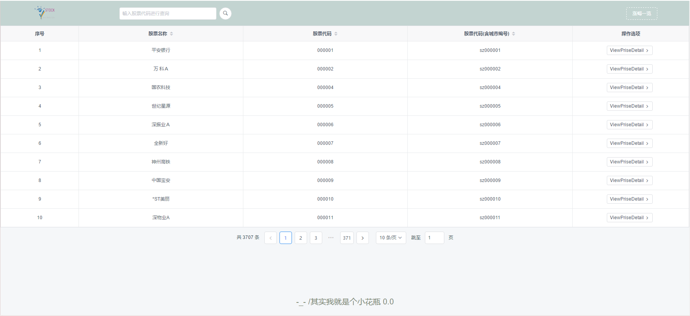
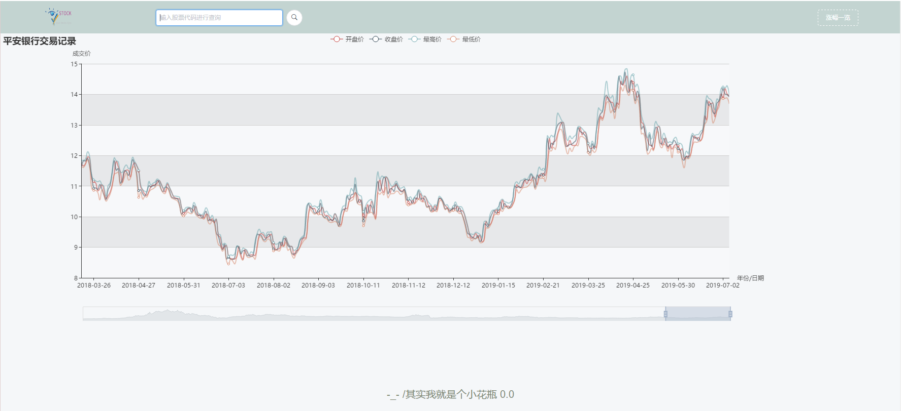
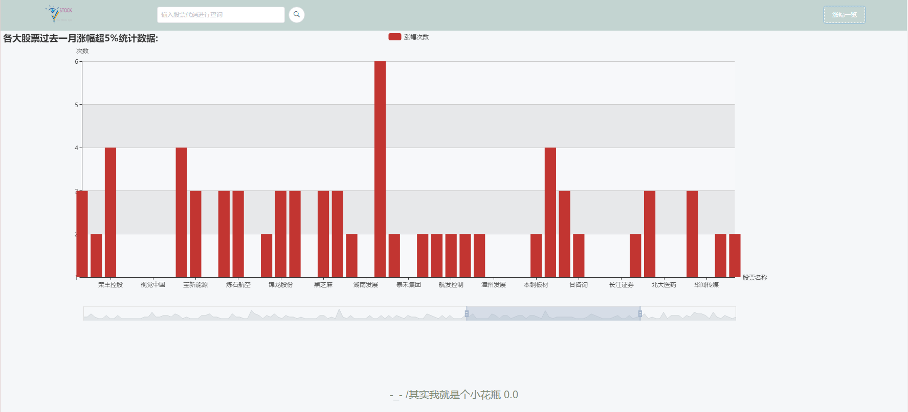

##STOCKVIEW 说明

### 环境需求
>项目使用springMVC + vue 进行编写
***
* 安装Node.js,配置相关环境确保运行正常
* 安装IDEA 开发工具
* 安装JDK 1.8 + 
* 安装Mysql 5.6 +
***
### 项目导入步骤
* 在mysql数据库中创建数据库：stock，执行stock/src/resource/static/DB文件下的sql文件创建相关表结构;可选择带数据的文件
创建表。

* 使用IDEA导入stock文件夹，打开application.properties文件更改相关数据库配置信息(用户名，密码)，运行程序。

* 进入stock-web文件夹下执行 npm install 命令安装相关依赖包，所有依赖加载后执行 npm run serve 命令，待出现访问地址信息后，
按照提示进入浏览器访问提示的地址。
***
### 运行效果
* 股票列表

* 历史记录

* 涨幅一览

